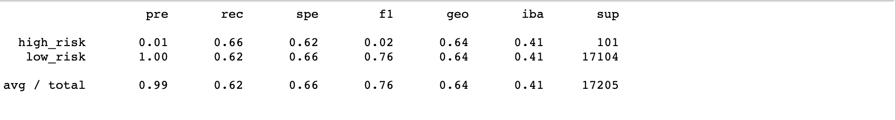
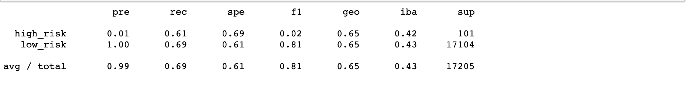
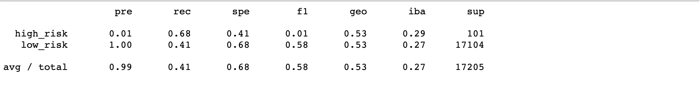
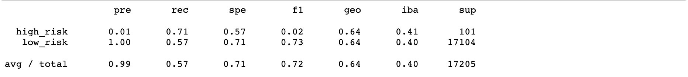
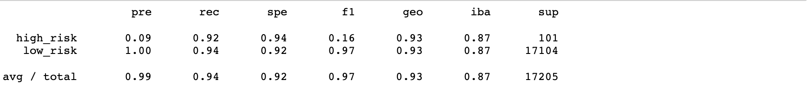
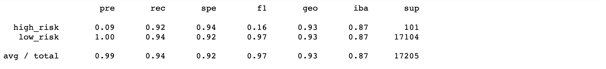

# Credit_Risk_Analysis

## Purpose:

In this analysis, we used python, the imbalanced-learn and scikit-learn libraries, to build a machine learning model to predict credit risk. Using the credit card credit dataset from LendingClub, we used the RandomOverSampler, SMOTE algorithms, and undersample the data using the ClusterCentroids algorithm. We used the combinatorial approach of over-and undersampling using the SMOTEENN algorithm. We also compare between BalancedRandomForestClassifier and EasyEnsembleClassifier to make an evaluation and predict credit risk.

## Results: 

### RandomOverSampler

Accuracy Score: 0.64

Precision High Risk: 0.01

Precision Low Risk: 1.00

Recall High Risk: 0.66

Recall Low Risk: 0.62

### SMOTE

Accuracy Score: 0.65

Precision High Risk: 0.01

Precision Low Risk: 1.00

Recall High Risk: 0.68

Recall Low Risk: 0.61

### ClusterCentroids

Accuracy Score: 0.54

Precision High Risk: 0.01

Precision Low Risk: 1.00

Recall High Risk: 0.68

Recall Low Risk: 0.41

### SMOTEENN

Accuracy Score: 0.64

Precision High Risk: 0.01

Precision Low Risk: 1.00

Recall High Risk: 0.71

Recall Low Risk: 0.57

### BalancedRandomForestClassifier

Accuracy Score:0.78

Precision High Risk: 0.03

Precision Low Risk: 1.00

Recall High Risk:0.70

Recall Low Risk: 0.87

### EasyEnsembleClassifier

Accuracy Score: 0.93

Precision High Risk: 0.09

Precision Low Risk: 1.00

Recall High Risk: 0.92

Recall Low Risk: 0.94

## Summary:

Data shows that the Easy Ensemble Classifier has an accurary score of 0.93, recall low risk of 0.94 and recall high risk of 0.92. I would recommend the Easy Ensemble Classifier on the accurarcy score and recall Risks was the highest. 